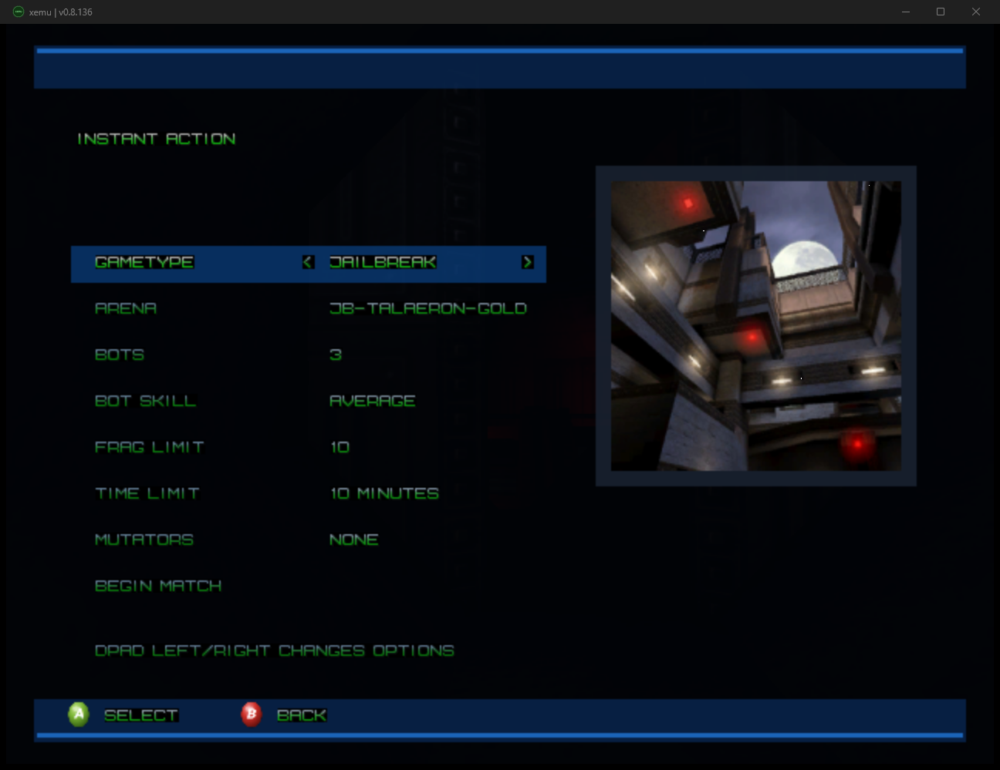
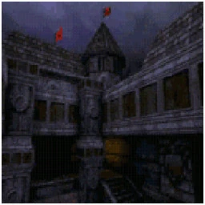
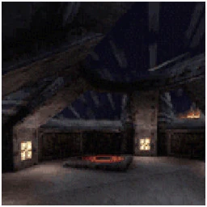

# Unreal Tournament Xbox

Release-only page for the original Xbox port of *Unreal Tournament: Game of the Year Edition*.

<p>
  <a href="https://github.com/GTTeancum/UT99-Xbox-Releases/releases/latest"><strong>Download the latest release</strong></a>
</p>

<p>
  
</p>

<p>
  
  
</p>

## 1.0RC1 Includes

- Original Xbox `default.xbe`
- Xbox menu assets, controller icons, PS2 character portraits, and converted Xbox music files
- PlayStation 2 character support packages and skins
- Jailbreak III Gold runtime files
- UT99 Console Map Pack PS2/DC 2026-05-29, with 39 converted console arena maps

## Installation

This package is for owners of *Unreal Tournament: Game of the Year Edition* on PC. It does not include the base PC game data.

1. Create a folder on your Xbox hard drive, for example `E:\Games\UnrealTournament\`.
2. From your own Unreal Tournament GOTY PC install, copy only these base game folders AND file types:

```text
UnrealTournament\
  Maps\
    *.unr
  Textures\
    *.utx
  Sounds\
    *.uax
  Music\
    *.umx
  System\
    *.u
    *.int
    *.ini
```

3. Do not copy PC executables, DLLs, editor files, logs, cache files, compressed downloads, Help, Web, or other desktop-only files.
4. Copy everything from this RC package into the same Xbox folder after the GOTY files. Allow this package to overwrite files when asked.
5. Launch `default.xbe` from your dashboard.

The final Xbox folder should contain `default.xbe` plus `System`, `Maps`, `Textures`, `Sounds`, `Music`, `MusicXbox`, and `MenuAssets` folders. `Voice` is optional if your source install has it.

## Notes

- Jailbreak is available from Instant Action as `JAILBREAK`.
- The console maps appear under their normal DM, CTF, and DOM map prefixes.
- The PS2 characters are available from the player and bot character lists.
- Keep this package's `Default.ini` and `UnrealTournament.ini` in `System`; they are required for Xbox play, menus, controls, audio, and bundled content.
- Mods not included in this package are not supported. Try other mods at your own risk.

## Credits

*Unreal Tournament* was created by Epic Games and Digital Extremes. Original PC publishing was by GT Interactive, with later console publishing by Infogrames. Original music credits include Straylight Productions and Michiel van den Bos.

Original console releases and content are credited to their respective Unreal Tournament PlayStation 2 and Dreamcast teams. The Dreamcast release credits Secret Level Games, Infogrames, Epic Games, and Digital Extremes. Console map author details are preserved in the release archive under `Docs\Console_Map_Pack_README.txt`.

Jailbreak III Gold is credited to Team Jailbreak. Public history credits Daikiki, Mychaeel, and ElBundee as the core Jailbreak III team. Bundled Jailbreak map and content credits include David Munnich, Daniel "MClane" Pflugbeil, Cory Spooner "TheSpoonDog", Emil "Hyperion" Attlid, Eric "SnowDog" Ettes, Alexander "lehmi" Lehmann, Sjoerd "Hourences" De Jong, NYGrrrl, ElBundee, and the other contributors recorded with the mod.

Advanced Model Support is credited in its package metadata to Psychic_313. PS2 character models, skins, and voices are derived from the original Unreal Tournament console content and remain property of their respective owners.

Xbox port, integration, validation, and release package: GTRemyLebeau and OpenAI Codex.

## Legal

This package is for owners of *Unreal Tournament: Game of the Year Edition*. Unreal Tournament, Unreal, the Unreal logo, and all original game assets remain property of their respective owners. Third-party mod and map content remains property of its respective authors.
