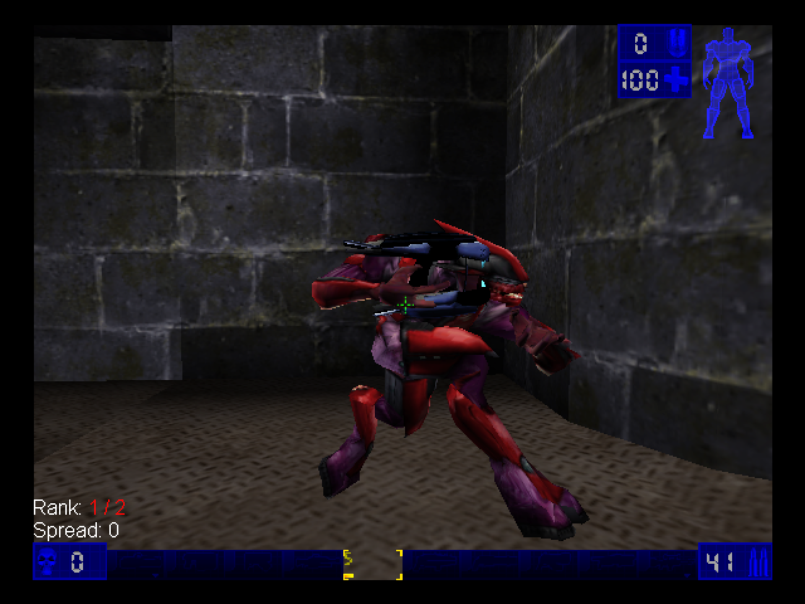

# Unreal Tournament Xbox

Release and support page for the original Xbox port of *Unreal Tournament: Game of the Year Edition*

  <a href="https://github.com/GTTeancum/UT99-Xbox-Releases/releases/tag/1.2"><strong>Download version 1.2</strong></a>

Version **1.2** is a full package, not a patch. Install it in a clean folder and don't merge an older release's System files or configuration into it.

## What's changed in 1.2

- Halo Elite, with team colors, a proper portrait, and bot support
- HaloUT Assault Rifle, Pistol and Plasma Rifle: one set, no separate reload versions
- Improved split-screen performance and consistent controller sensitivity
- Per-profile crosshair, HUD colors and opacity
- Match settings that stick after restarting
- Whole-picture safe margin and corrected widescreen HUD and split-screen settings menus
- Dashboard-controlled 480p/480i output, with a wider single-player view and 4:3 pillarboxed split-screen
- Music and sound stop when loading begins

[Full release notes](https://github.com/GTTeancum/UT99-Xbox-Releases/releases/tag/1.2)

System Link is still experimental. Co-op Tournament and skeletal LOD work remain deferred. Video output stays at 480i/480p.

## Feature Highlights

- Full Unreal Tournament GOTY gameplay on original Xbox
- Tournament, Instant Action, Jailbreak III Gold, Split Screen, and System Link
- 39 converted PlayStation 2 and Dreamcast arena maps
- PlayStation 2 Character Pack 3.0, Epic custom models, Master Chief and Halo Elite
- Per-player profiles for names, characters, team preference, controls, and Tournament progress
- Xbox-focused menus, controller presets, safe-area controls, video adjustment, and dashboard artwork

## Screenshots

  

*Version 1.2: Halo Elite with the HaloUT plasma rifle on DM-Turbine. Captured in Xemu at 1920 × 1440 with increased gamma.*

  

  
  

## Installation

This package is for owners of *Unreal Tournament: Game of the Year Edition* on PC. It does not include the base PC game assets.

1. Create a clean folder on the Xbox hard drive, such as `E:\Games\UnrealTournament\`
2. Copy everything from the v1.2 package into that folder
3. From your own Unreal Tournament GOTY PC installation, copy only `Maps`, `Textures`, `Sounds`, and `Music`, then merge those folders with the release
4. Do not copy the PC `System` folder or an older release's System files and configuration
5. Launch `default.xbe`

The first press of Start after the intro flyby opens profile selection. Create or load a profile to enter the main menu.

Widescreen follows the video setting in the Xbox dashboard automatically. There is no separate aspect-ratio option in the game.

## Reporting Problems

[Open an issue](https://github.com/GTTeancum/UT99-Xbox-Releases/issues) and include:

- The map and game mode
- Player and bot count
- Display and widescreen settings
- Whether the match was local or System Link
- What happened immediately before the problem
- Screenshots or a short video when the problem is visual

Please upload `ut99.log` whenever possible. Use FTP to copy it from beside `default.xbe` on the Xbox to your PC. Open the GitHub issue editor, click inside the large description textbox, and drag `ut99.log` from File Explorer into that box. Wait for GitHub to insert the uploaded file link before submitting the issue.

## Notes

- Console and community maps appear under their normal DM, CTF, DOM, and JB prefixes
- Keep the release's `Default.ini`, `DefUser.ini`, `UnrealTournament.ini`, and `User.ini`
- The connection-problem icon remains active and can still appear when the game detects a genuine network problem
- Install updates into a clean folder before copying the four owned PC asset folders

## Credits

*Unreal Tournament* was created by Epic Games and Digital Extremes. Original PC publishing was by GT Interactive, with later console publishing by Infogrames. Original music credits include Straylight Productions and Michiel van den Bos.

The converted PlayStation 2 and Dreamcast map set preserves work by Cliff Bleszinski, Dave Ewing, Eric "Ebolt" Boltjes, Cedric "Inoxx" Fiorentino, Juan Pancho "XceptOne" Eekels, Rich "Akuma" Eastwood, Alan "Talisman" Willard, and Warren Marshall. Per-map details are retained in `Docs/Console_Map_Pack_README.txt`.

[Jailbreak III Gold](https://unrealarchive.org/unreal-tournament/gametypes/J/jailbreak-iii/index.html) is credited to Daikiki, ElBundee, Mychaeel, its original and Gold map-pack teams, Sioux "NYGrrrl" Blue, its mutator and interface authors, testers, and all additional contributors retained in the original documentation.

Community content:

- CTF-Titania: Squacky; UTDMT by Patrick Cyr (GorGor); Quake III-derived art by id Software
- [DM-HangEmHigh](https://unrealarchive.org/unreal-tournament/maps/deathmatch/H/dm-hangemhigh_3b0fe14d.html): jkcrmptn
- [DM-Halo-Derelict](https://unrealarchive.org/unreal-tournament/maps/deathmatch/H/dm-halo-derelict_0ea4e9f6.html): [^..^]APOCALYPSE (Cirion UT 2K4 / Perfect Chaos), with additional credits retained from its readme
- PlayStation 2 Character Pack 3.0: AlCapowned; original PS2 models by James Green and Epic Games
- Advanced Model Support: Psychic_313
- Master Chief conversion: author not identified in the supplied package metadata; Unreal Archive also lists it as Unknown
- AgentX and Akimbo retain the authorship and attribution supplied with their original packages

Halo, Master Chief, and related content are credited to Bungie and Microsoft; the Derelict map lineage also credits Gearbox. Full attribution, source references, map authors, and original Jailbreak documentation are included in every release.

Xbox port, integration, validation, and release package: GTRemyLebeau and OpenAI Codex.

## Legal

This package is for owners of *Unreal Tournament: Game of the Year Edition*. Unreal Tournament, Unreal, the Unreal logo, and all original game assets remain property of their respective owners. Third-party mod and map content remains property of its respective authors.
